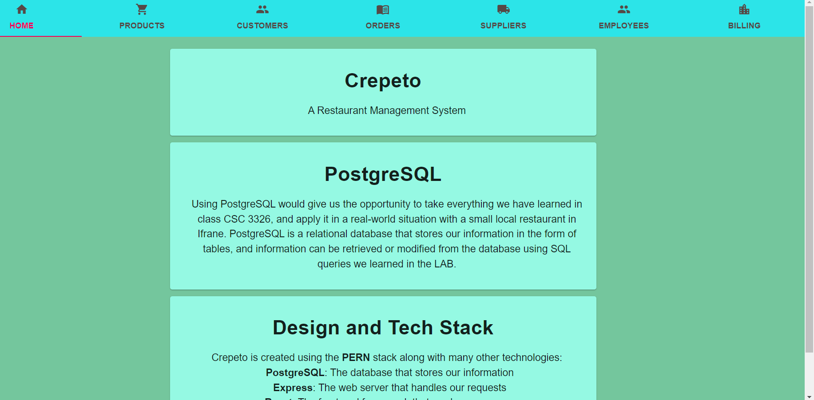

# Crepeto



## Database Project using React: (Material UI/PosgreSQL)

## Allows the manager the have full managerial control over his business

### The manager or admin can Add, Delete, manage and Search Orders, Customer, Suppliers, Employees, and Billing.

To use/view this system you need to:

1- Clone or Download this repository

2- Have node.js pre-installed in you computer

3- Launch your IDE and cd into the project

4- open terminal and run:

##### - `npm or yarn install` to install node modules in client + server folders

##### - `npm or yarn start` to open development in localhost -> client: 3000, server: 3090

5- Set up PSQL database and create tables

```
CREATE TABLE customer (
customer_id SERIAL PRIMARY KEY,
name VARCHAR(255),
phone VARCHAR(255),
email VARCHAR(255),
address VARCHAR(255)
);

CREATE TABLE billing (
MonthyBilling_id SERIAL PRIMARY KEY,
revenue VARCHAR(255),
expense VARCHAR(255),
profit VARCHAR(255),
);

CREATE TABLE supplier (
supplier_id SERIAL PRIMARY KEY,
name VARCHAR(255),
address VARCHAR(255),
phone VARCHAR(255)
);

CREATE TABLE product (
product_id SERIAL PRIMARY KEY,
product_name VARCHAR(255),
quantity INTEGER,
price FLOAT(10),
supplier_id INTEGER REFERENCES supplier(supplier_id)
);

CREATE TABLE orders (
order_id SERIAL PRIMARY KEY,
order_name VARCHAR(255),
order_date DATE,
product_quantity INTEGER,
customer_id INTEGER REFERENCES customer(customer_id),
product_id INTEGER REFERENCES product(product_id)
);

CREATE TABLE employee (
employee_id SERIAL PRIMARY KEY,
name VARCHAR(255),
address VARCHAR(255),
phone VARCHAR(255),
email VARCHAR(255),
salary VARCHAR(255)
);
```

### View website -> https://crepeto.netlify.app/

### You can see this website's API using the link https://crepeto-api.herokuapp.com/

##### API not public yet, still in production
