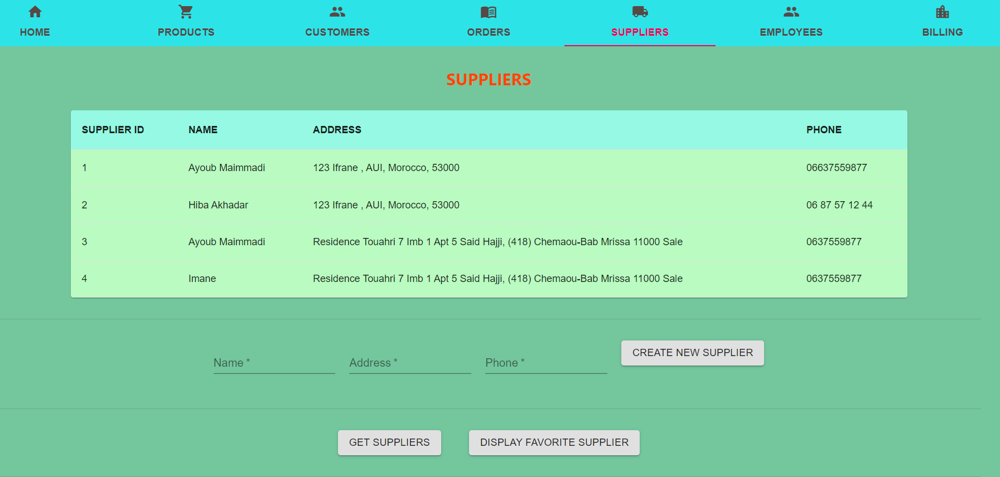

# Crepeto

## Database Project using React: (JS/MUI/PSQL/...)

## Allows the manager the have full managerial control over his business

### He can Add, Delete, and Search Orders, Customer, Suppliers, and Employees

To use/view this system you need to:

1- Clone or Download this repository

2- Have node.js pre-installed in you computer

3- Launch your IDE and cd into the projct

4- open terminal and run:

##### - `npm or yarn install` to install node modules in client + server

##### - `npm or yarn start` to open in localhost -> client: 3000, server: 3090

5- Set up PSQL database and create tables

`CREATE TABLE customer (
customer_id SERIAL PRIMARY KEY,
name VARCHAR(255),
phone VARCHAR(255),
email VARCHAR(255),
address VARCHAR(255)
);

CREATE TABLE billing (
MonthyBilling_id SERIAL PRIMARY KEY,
revenue VARCHAR(255),
expense VARCHAR(255),
profit VARCHAR(255),
);

CREATE TABLE supplier (
supplier_id SERIAL PRIMARY KEY,
name VARCHAR(255),
address VARCHAR(255),
phone VARCHAR(255)
);

CREATE TABLE product (
product_id SERIAL PRIMARY KEY,
name VARCHAR(255),
quantity INTEGER,
price FLOAT(10),
supplier_id INTEGER REFERENCES supplier(supplier_id)
);

// Table name order doesn't work for some reason
CREATE TABLE order_details (
order_id SERIAL PRIMARY KEY,
order_date DATE,
order_time DATE,
product_quantity INTEGER,
customer_id INTEGER REFERENCES customer(customer_id),
product_id INTEGER REFERENCES product(product_id)
);

CREATE TABLE employee (
employee_id SERIAL PRIMARY KEY,
name VARCHAR(255),
address VARCHAR(255),
phone VARCHAR(255),
email VARCHAR(255),
salary VARCHAR(255)
);`

### You can view this website using the link https://crepeto.netlify.app/

### You can see this website's API using the link https://crepeto-api.herokuapp.com/
